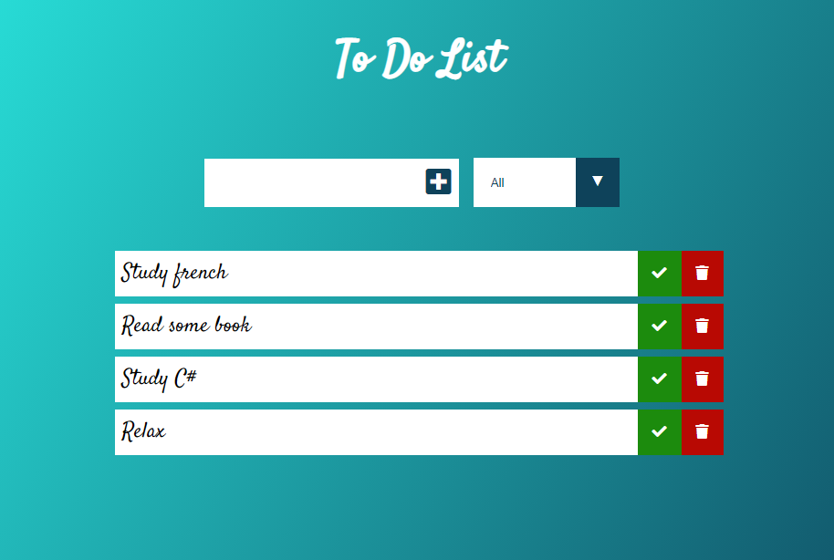

# Simple  To Do List

### Technologies used:
* Vanilla Javascript
* HTML
* CSS
* Node.js

### Practiced:
* Usage of event listeners
* Filter a list
* How to use local storage
* Adding classes on HTML according to JS function
* How to use Goodle Fonts and Font Awesome
* CSS transition effects
* How to use express and serve on localhost

### Result:

